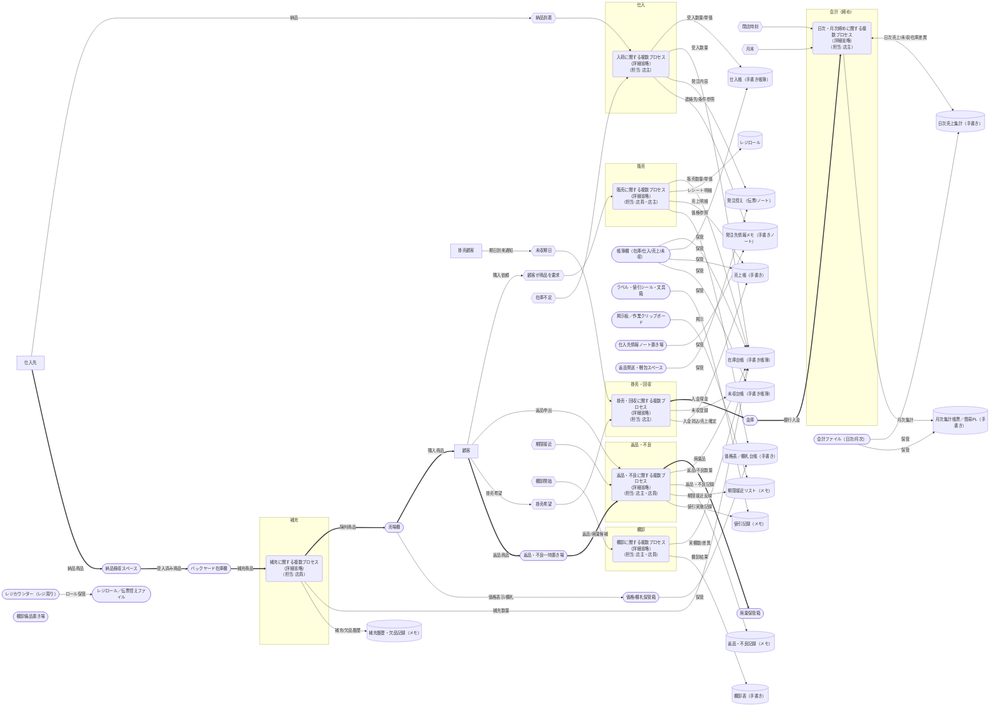

# 販売管理概念データフロー図（現状）

## 業務一覧

| 業務グループ | 業務 | 業務内容 | 担当 | 業務が発生するイベント | インプット | アウトプット |
|--------------|------|----------|------|------------------------|------------|--------------|
| 仕入・補充 | 在庫不足検知 | 売場/在庫台帳（紙）を目視・数合わせで不足品目を判断 | 店主 | 在庫不足（売場欠品/台帳残少） | 売場棚の現物状況, 在庫台帳（手書き帳簿）残数 | 発注要否判断メモ（手書き） |
| 仕入・補充 | 仕入発注 | 仕入先へ電話/FAX/訪問で数量・品目を発注 | 店主 | 在庫不足判断完了 | 発注要否判断, 過去仕入履歴（紙） | 発注控え（複写伝票/ノート）/口頭依頼内容 |
| 仕入・補充 | 納品受入 | 納品物と発注内容突合、数量・破損確認 | 店主 | 納品到着 | 納品商品, 発注控え（紙） | 受入確認済み商品, 仕入帳（手書き帳簿）記入 |
| 仕入・補充 | 品出し（棚補充） | 受入済み/在庫から棚へ陳列補充 | 店主 | 欠品/納品後 | 在庫商品（バックヤード）, 棚の空き | 陳列済み商品, 補充数量記録（手書きメモ・任意） |
| 仕入・補充 | 棚卸 | 現物数と台帳差異の計数・記録・調整案作成 | 店主 | 棚卸開始（週次/月次/不定期） | 在庫台帳（手書き帳簿）, 現物商品 | 棚卸表（手書き）, 差異明細, 調整案 |
| 仕入・補充 | 在庫調整 | 棚卸差異/返品/廃棄等を台帳へ手書き反映 | 店主 | 棚卸差異確定 / 返品・不良確定 | 棚卸表（手書き）, 返品/廃棄数量メモ | 更新済み在庫台帳（手書き帳簿） |
| 販売 | 購買受付 | 顧客希望商品の確認、価格伝達、簡易おすすめ | 店主 | 顧客来店/購入依頼 | 顧客要求, 商品現物 | 販売品目決定情報 |
| 販売 | 代金授受（現金） | 現金受取、釣り銭、レジ打鍵、売上伝票記入 | 店主 | 現金支払い意思表示 | 販売品目・数量, 単価 | 現金売上, レジロール, 売上帳（手書き）更新 |
| 販売 | 掛売登録（つけ） | 顧客の後払い希望内容を未収台帳（手書き帳簿）へ記録 | 店主 | 顧客掛売希望 | 顧客識別情報, 販売品目 | 未収台帳（手書き帳簿）エントリ, 暫定売上情報 |
| 販売 | 掛売精算 | 掛売分の入金受領と未収台帳/売上確定更新 | 店主 | 未収期日到来/顧客支払い | 未収台帳（手書き帳簿）項目, 現金/支払情報 | 未収消込（帳簿に記入）, 売上確定記録 |
| 販売 | 期限接近確認 | 消費期限/賞味期限の近い商品を棚・在庫から目視で抽出 | 店主 | 定期チェック/日付条件 | 商品ラベル（手書き）, 在庫一覧（台帳） | 期限接近リスト（手書きメモ） |
| 返品・不良 | 顧客返品受付 | 顧客からの返品理由確認、再販可否判定 | 店主 | 顧客返品申出 | 返品商品, 売上伝票控え | 返品可否結果, 返品数量（手書き記録） |
| 返品・不良 | 不良/期限処理 | 不良/期限切迫品の再陳列/値引/廃棄/仕入先返品判断 | 店主 | 期限接近リスト/不良検知 | 期限接近リスト（手書き）, 不良品現物 | 処理結果記録（手書きメモ）, 在庫調整数量 |
| 会計・記録 | 売上記録更新 | 現金売上・掛売確定分を日次で集計（電卓使用） | 店主 | 日次締め開始 | 売上帳（手書き明細）, レジロール | 日次売上集計（手書き）, 会計帳票一部 |
| 会計・記録 | 未収残高確認 | 未収台帳（手書き帳簿）の期限・金額チェック | 店主 | 日次/週次確認タイミング | 未収台帳（手書き帳簿） | 入金催促候補リスト（手書きメモ） |
| 会計・記録 | 日次締め | 売上/未収/在庫調整差異を日次レベルで確定 | 店主 | 閉店時刻 | 日次売上明細（手書き）, 未収残高, 在庫差異 | 日次集計表（手書き）, 会計帳票原票 |
| 会計・記録 | 月次締め | 日次集計集約・原価/ロス集計・簡易利益算出（電卓使用） | 店主 | 月末 | 日次集計表（手書き）, 在庫差異累積, 仕入帳 | 月次集計帳票（手書き）, 簡易PLメモ |
| マスタ・準備 | 価格/商品ラベル更新 | 新商品や価格改定時に棚札/台帳へ手書き反映 | 店主 | 仕入先連絡/価格改定 | 仕入先通知（電話/訪問）, 既存価格表（手書き） | 更新済み価格表示（手書き札）, 台帳修正 |
| マスタ・準備 | 発注先情報管理 | 仕入先連絡先・条件メモ更新（手書きノート） | 店主 | 変更通知/取引開始 | 仕入先からの連絡（電話/訪問） | 発注先情報メモ（手書きノート）最新化 |
| 監視・改善 | ロス分析 | 返品/廃棄/棚卸差異を分類し原因仮説作成（手書き集計） | 店主 | 月次締め後 | 返品記録（手書き）, 棚卸差異, 廃棄数量メモ | 改善候補リスト（手書きメモ） |
| 監視・改善 | 値引施策実施 | 期限接近品に値引シール貼付 | 店主 | 期限接近リスト更新 | 期限接近リスト（手書き）, 対象商品 | 値引済み商品, 値引記録（手書きメモ・任意） |
| 監視・改善 | 補充頻度最適化 | 補充履歴/欠品発生から頻度調整（経験則） | 店主 | 欠品多発/在庫過多判明 | 補充履歴メモ（手書き）, 欠品記録 | 新しい補充ルールメモ（手書き） |

## データストア一覧

| データストア | 内容 | インプット | アウトプット |
|---|---|---|---|
| 在庫台帳（手書き帳簿） | 商品別在庫数、受入・調整履歴 | 納品受入結果、棚卸結果、在庫調整（返品・廃棄） | 在庫残一覧、在庫不足判断材料、在庫差異情報 |
| 仕入帳（手書き帳簿） | 仕入日・品目・数量・単価・金額、仕入先 | 納品受入結果、発注控え情報 | 仕入実績一覧、原価集計、月次集計入力 |
| 発注控え（伝票/ノート） | 発注日、品目、数量、仕入先、条件 | 仕入発注内容 | 納品突合用情報、発注履歴参照 |
| レジロール | 現金販売の取引明細（日時・品目・数量・金額） | 代金授受（レジ打鍵） | 売上記録更新用明細、日次締め根拠 |
| 売上帳（手書き） | 現金売上・掛売確定の明細 | 代金授受結果、掛売精算結果 | 日次売上集計、月次集計入力 |
| 未収台帳（手書き帳簿） | 掛売顧客、金額、期日、入金履歴 | 掛売登録、入金（掛売精算） | 未収残高一覧、催促候補、売上確定更新 |
| 返品・不良記録（メモ） | 返品理由、数量、可否／不良・廃棄数量と処理結果 | 顧客返品受付、不良/期限処理 | 在庫調整入力、ロス分析入力 |
| 棚卸表（手書き） | 実棚数、台帳差異、調整案 | 棚卸作業結果 | 在庫調整指示、差異明細、ロス分析入力 |
| 期限接近リスト（メモ） | 期限接近商品の一覧 | 期限接近確認 | 値引施策対象、返品/廃棄判断入力 |
| 日次売上集計（手書き） | 売上・未収・在庫差異の日次集計 | 売上帳、レジロール、未収残高、在庫調整 | 日次締め確定値、会計帳票原票 |
| 月次集計帳票／簡易PL（手書き） | 月次売上、原価、ロス、粗利 | 日次集計、仕入帳、在庫差異累積 | 経営判断資料、ロス分析入力 |
| 価格表／棚札台帳（手書き） | 商品名、売価、表示情報 | 価格/商品ラベル更新（仕入先通知） | 価格表示更新、販売時の価格参照 |
| 発注先情報メモ（手書きノート） | 仕入先の連絡先・条件・支払条件 | 発注先情報管理（変更・新規） | 仕入発注時の参照情報 |
| 補充履歴・欠品記録（メモ） | 補充日時・数量、欠品発生履歴 | 品出し結果、欠品検知 | 補充頻度最適化の入力、欠品分析 |
| 値引記録（メモ） | 値引対象、値引率/金額、実施日時 | 値引施策実施 | 売上帳への反映、ロス/粗利分析入力 |

## 物理保管場所一覧

| 物理保管場所 | 内容 | インプット | アウトプット |
|---|---|---|---|
| 売場棚 | 販売用陳列、価格表示、期限ラベル | 補充商品、価格/棚札、値引シール | 販売品目・数量、欠品情報、期限接近候補 |
| バックヤード在庫棚 | 補充前在庫の保管 | 受入確認済み商品、在庫調整反映後の商品 | 品出し対象、棚卸実棚数 |
| 納品検収スペース | 納品物の検品・突合場所 | 納品商品、発注控え | 受入確認メモ、受入済み商品の移動 |
| 返品・不良一時置き場 | 返品/不良/期限接近品の隔離保管 | 顧客返品品、不良判定品 | 再陳列可否結果、在庫調整数量、仕入先返品対象 |
| 廃棄保管箱 | 廃棄予定品の一時保管 | 廃棄判定品 | 廃棄処理、廃棄記録 |
| レジカウンター（レジ周り） | 現金授受・レジ打鍵・簡易記録 | 販売品目・数量、単価、現金/掛売指示 | 現金売上、レジロール、売上帳記入材料 |
| レジロール／伝票控えファイル | レジロールと各種控えの保管 | レジロール、売上伝票控え、発注控え | 売上記録更新根拠、納品突合資料 |
| 帳簿棚（在庫台帳・仕入帳・売上帳・未収台帳） | 紙帳簿の保管・参照・更新 | 記入済み各帳簿、追記メモ | 集計・照合・催促確認の参照情報 |
| 会計ファイル（日次/月次） | 日次売上集計、月次集計、簡易PLの保管 | 日次集計、月次集計、原価/ロス集計メモ | 会計帳票原票、経営判断資料 |
| 価格/棚札保管箱 | 価格表、棚札、予備ラベルの保管 | 価格改定通知、更新指示メモ | 更新済み棚札、価格表示 |
| ラベル・値引シール・文具箱 | ラベル/値引シール/筆記具等の備品 | 値引施策準備、備品補充 | 値引済み商品ラベル、更新ラベル |
| 掲示板／作業クリップボード | 作業指示・各種メモの掲示 | 期限接近リスト、催促候補、補充/欠品メモ | 値引・返品・補充・催促の実施指示 |
| 棚卸備品置き場 | クリップボード、数取り表、電卓等 | 空白棚卸表、筆記具 | 記入済み棚卸表、差異明細 |
| 仕入先情報ノート置き場 | 発注先連絡先・条件ノート | 仕入先からの連絡、更新メモ | 発注時参照情報、連絡先確認 |
| 返品発送・梱包スペース | 返品梱包資材・送状控えの保管 | 返品決定品、発送伝票 | 仕入先返送荷物、送状控え |
| 金庫 | 現金・印鑑等の管理 | 日次売上現金、掛売精算入金 | 銀行入金、現金残高（締め時点） |

## 外部主体一覧

| 外部主体 | 内容 | インプット | アウトプット |
|---|---|---|---|
| 顧客（現金購入） | 来店して現金で購入、必要に応じて返品を行う | 価格/商品情報、値引表示、販売説明、釣銭、売上伝票（顧客控え） | 購買要求、購入品目・数量、現金支払い、返品申出・返品商品 |
| 掛売顧客 | 後払い（つけ）取引の顧客。期日到来で精算 | 掛売条件通知、売掛残高・期日案内、精算金額通知、売上伝票（顧客控え） | 顧客識別情報、掛売希望/承認、入金（掛売精算） |
| 仕入先 | 商品供給、価格改定連絡、返品対応 | 発注内容（品目・数量・条件）、問い合わせ、返品依頼・返品品 | 納品商品・納品書、価格改定通知、取引条件/連絡先情報、返品可否・代替/値引連絡 |

## データフロー（全体概要）

凡例と記号の意味は「mermaid-dfd-rules.md」を参照してください。

