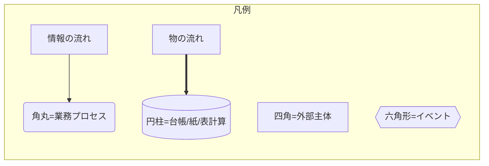
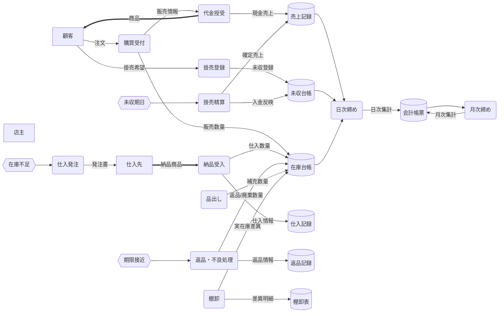
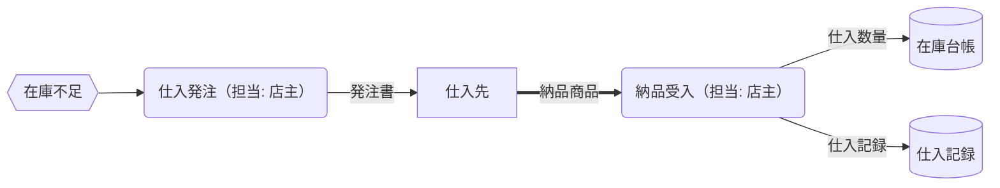
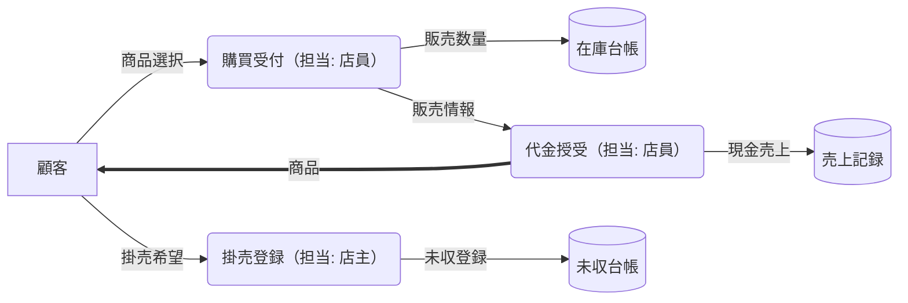
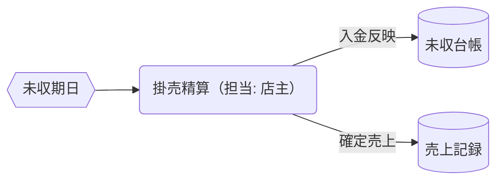
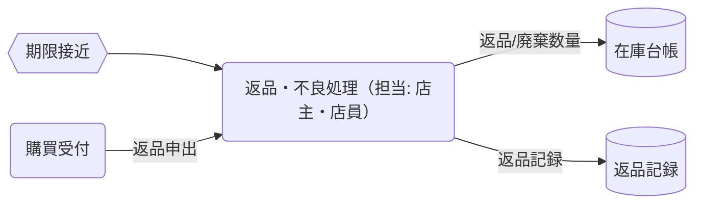
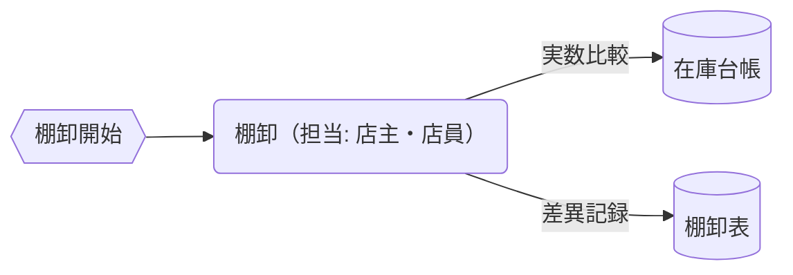
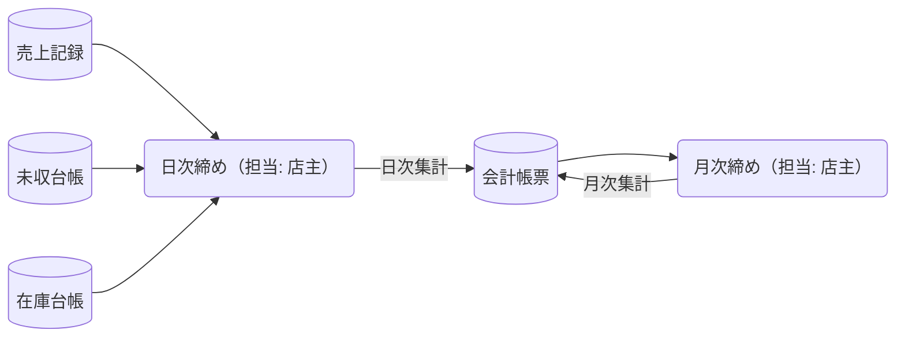

# 販売管理概念データフロー図（現状）

本ページでは、現状（非システム化・台帳/紙/表計算での運用）を対象に、駄菓子屋の販売関連業務をDFD（データフロー図）で記述します。記法は `mermaid-dfd-instruction.md` に準拠しています。

---

## 全体データフロー（現状）

### 全体のポイント

- 台帳（在庫・未収・売上・仕入・返品・棚卸）は紙/表計算で管理。
- 物の流れ（商品）は `==>`、情報（記録/伝票）は `-->` で表現。
- イベント（在庫不足/期限接近/未収期日）を起点に業務が発火。

---

## 個別フロー：仕入れ（在庫反映まで）

説明:

- 担当: 店主
- 目的: 不足在庫の補充。
- 入力: 在庫不足イベント、発注書、納品商品。
- 出力: 在庫台帳更新、仕入記録更新。

---

## 個別フロー：品出し（棚補充）

説明:

- 担当: 店員
- 目的: 売場の欠品回避。
- 入力/出力: 在庫台帳の参照・調整。

---

## 個別フロー：販売（現金/掛売）

説明:

- 担当: 購買受付/代金授受=店員、掛売登録=店主
- 目的: 販売処理と台帳反映。
- 現金売上はその場で売上記録、掛売は未収台帳に登録。

---

## 個別フロー：掛売（つけ）精算

説明:

- 担当: 店主
- 目的: 未収金の回収と売上確定。
- 入力: 未収期日イベント、入金情報。
- 出力: 未収台帳更新、売上確定。

---

## 個別フロー：返品・不良・期限

説明:

- 担当: 店主（判断）・店員（実作業）
- 目的: 不良・期限接近の適切処理（再陳列/値引/廃棄/仕入先返品は現状簡易運用）。
- 出力: 在庫台帳調整、返品記録。

---

## 個別フロー：棚卸

説明:

- 担当: 店主・店員
- 目的: 帳簿在庫と実在庫の差異解消、ロス可視化。
- 出力: 在庫台帳の差異調整、棚卸表の保管。

---

## 個別フロー：日次・月次締め（会計）

説明:

- 担当: 日次締め・月次締め=店主
- 目的: 日次/月次の実績確定と帳票作成。
- 入力: 売上/未収/在庫差異。出力: 会計帳票。

---

注意: 現状はいずれも手作業（紙や表計算）での台帳更新・集計を前提としています。システム化の際は、イベント駆動・整合性制御・承認ワークフロー等を設計に反映します。
