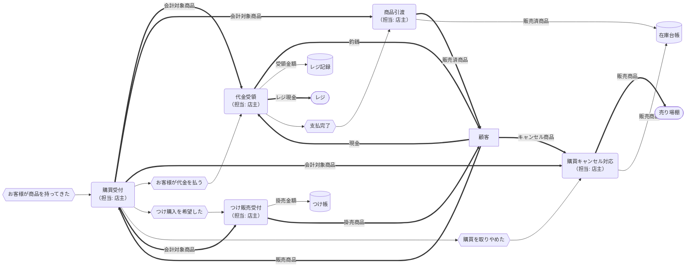

# 販売管理概念データフロー図（現状）

※凡例と記号の意味は「mermaid-dfd-rules.md」を参照してください。

## プロセスの全体概要

### プロセスグループ概要

| プロセスグループ | 主な業務                                 | 業務目的                                           |
| ---------------- | ---------------------------------------- | -------------------------------------------------- |
| 調達             | 発注・受入・在庫管理                     | 売るための商品を確保する。商いの原資をつくる。     |
| 販売             | 商品の提示・販売受付・代金受領・商品引渡 | 商品をお客様に提供し、対価のやり取りを成立させる。 |
| 会計             | レジ締め・売上記録・仕入支払い・帳簿管理 | お金の流れを正確に把握し、商いの継続を可能にする。 |

### データストア

| データストア名 | 対応プロセス | 主な内容                                                     | 更新タイミング         | 主な用途                                     |
| -------------- | ------------ | ------------------------------------------------------------ | ---------------------- | -------------------------------------------- |
| 商品一覧表     | 調達         | 商品名、仕入単価、販売価格、分類（お菓子／玩具など）         | 新商品追加・価格変更時 | 商品情報の統一、仕入・販売・会計の基礎データ |
| 仕入台帳       | 調達         | 発注日、仕入先、商品名、数量、仕入単価、合計金額、支払状況   | 発注・納品時           | 仕入履歴と支払い管理、原価把握               |
| 在庫台帳       | 調達、販売   | 商品名、入庫数、出庫数、現在庫数、賞味期限                   | 仕入・販売・補充時     | 欠品防止、再発注判断、廃棄ロス管理           |
| 販売記録       | 会計         | 日付、販売金額、販売数量、売れ筋商品、販売方法（現金／つけ） | 日次（閉店時）         | 売上把握、販売分析、仕入見直し               |
| つけ帳         | 販売、会計   | お客様名、購入日、商品名・金額、支払期日、支払状況           | 購入時・支払い時       | つけ払い（後払い）の記録と回収管理           |
| レジ記録       | 販売、会計   | 日付、入金（売上）、出金（仕入・経費）、残高                 | 日次／支払い時         | 現金の入出金管理、レジ締め・差額確認         |
| 支払管理表     | 会計         | 支払先、支払日、金額、支払方法、ステータス                   | 請求書受領・支払い時   | 仕入や経費の支払い状況管理                   |
| 売上帳簿       | 会計         | 日次売上、つけ払い入金、経費、仕入原価、利益計算             | 月次／年次             | 会計全体の記録、税務・申告対応用             |

### 保管場所

| 保管場所     | 主な保管対象                         | 主な内容・目的                                                   | 関連プロセス | 管理頻度       |
| ------------ | ------------------------------------ | ---------------------------------------------------------------- | ------------ | -------------- |
| バックヤード | 商品在庫（未陳列）・段ボール・予備棚 | 納品された商品を保管し、数量と賞味期限を管理。補充元として機能。 | 調達／販売   | 納品時・補充時 |
| 売り場棚     | 販売中の商品                         | お客様が手に取る商品を配置。価格表示・補充・前出しを行う。       | 販売         | 開店前・営業中 |
| レジ         | 現金・レジ記録                       | 日次の売上金を管理し、入出金記録を保持。                         | 会計         | 日次           |
| 金庫         | 日次売上金                           | 売上金を安全に保管し、必要に応じて出金。                         | 会計         | 日次           |
| 銀行口座     | 事業用銀行口座                       | 仕入先や経費の支払い、売上金の入金を管理。                       | 会計         | 随時           |

### 商品のステータス

| ステータス   | 呼称         | 場所             | 主な業務       |
| ------------ | ------------ | ---------------- | -------------- |
| 仕入前       | 納入商品     | 仕入前           | 受入           |
| 仕入直後     | 在庫商品     | バックヤード     | 受入、在庫保管 |
| 検品不合格   | 返品商品     | バックヤード     | 検品           |
| 販売可能状態 | 販売商品     | 売り場棚         | 品出し、陳列   |
| 購買受付中   | 会計対象商品 | レジまわり       | 会計           |
| 後払い扱い   | 掛売商品     | つけ帳           | つけ回収       |
| 販売完了     | 販売済商品   | お客様へ提供済み | 商品引渡し     |

### お金のステータス

| ステータス                             | 呼称       | 保管場所           | 管理する帳簿・台帳   | 説明                                                     |
| -------------------------------------- | ---------- | ------------------ | -------------------- | -------------------------------------------------------- |
| 顧客から受け取ったお金                 | 売上金     | レジで一時的に受領 | レジ記録             | 会計直後のお金。顧客から受け取った瞬間のステータス。     |
| レジ内のお金                           | レジ現金   | レジ               | レジ記録             | 営業中に使う釣り銭と売上金の合算。営業中の管理単位。     |
| レジに最初から入れてあるおつり用のお金 | 釣銭準備金 | レジ               | レジ記録             | 営業開始前にレジに用意されているおつり用のお金。         |
| 金庫に入金したお金                     | 保管金     | 金庫               | レジ記録 ＋ 売上帳簿 | レジ締め後にレジから金庫へ移すお金。「一時保管」の段階。 |
| 銀行に入金したお金                     | 銀行預入金 | 銀行口座           | 売上帳簿             | 売上金が会計上確定される最終ステータス。                 |

### 外部主体と物理保管に着目したフロー

### データストアに着目したフロー

## 調達プロセスグループの詳細

### 調達プロセス概要

| プロセス | 業務内容                                                                         | 担当 | 業務が発生するイベント | インプット                 | アウトプット                                               |
| -------- | -------------------------------------------------------------------------------- | ---- | ---------------------- | -------------------------- | ---------------------------------------------------------- |
| 発注     | 問屋・メーカーに商品を注文する。必要数量・品目を決定。                           | 店主 | 在庫が足りなくなった   | 在庫商品数量、販売商品数量 | 発注書                                                     |
| 受入     | 納品物を受け取る。                                                               | 店主 | 商品が納入された       | 納入商品、納品書           | 受入情報                                                   |
| 検品     | 数量・品質・価格を確認し、問題がなければ在庫へ回す。不良があれば返品処理を行う。 | 店主 | 商品を受け取った       | 納入商品、納品書           | 検品済み商品、検品済み商品情報、不良時は返品商品・返品伝票 |
| 在庫保管 | 商品をバックヤードに保管し、賞味期限・残数を管理。                               | 店主 | 検品が完了した         | 検品済み商品               | 在庫商品                                                   |

### 調達プロセスのデータフロー

## 販売プロセスの詳細

### 販売プロセス概要

| プロセス           | 業務内容                                             | 担当 | 業務が発生するイベント         | インプット                 | アウトプット                         |
| ------------------ | ---------------------------------------------------- | ---- | ------------------------------ | -------------------------- | ------------------------------------ |
| 品出し             | 売り場棚の商品の減った分をバックヤードから補充する。 | 店主 | 売り場在庫が足りなくなった     | 在庫商品数量、販売商品数量 | 販売商品                             |
| 陳列               | 売り場棚に商品を整える。                             | 店主 | 開店の準備を始めた             | 販売商品                   | 販売商品                             |
| 購買受付           | お客様が選んだ商品を受け取り、販売手続きを開始。     | 店主 | お客様が商品をレジに持ってきた | 販売商品                   | 請求金額、会計対象商品               |
| 代金受領           | 現金で代金を受け取る。                               | 店主 | お客様が代金を払った           | 会計対象商品、受領現金     | 領収書、釣銭、レジ現金の更新、売上金 |
| 商品引渡           | 袋詰め・提供などを行い、お客様に商品を渡す。         | 店主 | お客様が代金を支払った         | 会計対象商品               | 販売済商品、販売数量情報             |
| 購買キャンセル対応 | お客様が購入を取りやめた商品を棚に戻す。             | 店主 | お客様が購買を取りやめた       | 会計対象商品               | 販売商品                             |
| つけ販売受付       | お客様の希望で代金を後払いとして記録。               | 店主 | お客様がつけ購入を希望した     | 会計対象商品               | 掛払商品、掛売伝票、つけ金額情報     |

### 販売プロセスのデータフロー（品出し、陳列）

### 販売プロセスのデータフロー（購買受付、代金受領、商品引渡し、キャンセル対応、つけ販売受付）

## 会計プロセスの詳細

### 会計プロセス概要

| プロセス   | 業務内容                                       | 担当 | 業務が発生するイベント | インプット                       | アウトプット                                    |
| ---------- | ---------------------------------------------- | ---- | ---------------------- | -------------------------------- | ----------------------------------------------- |
| レジ締め   | 売上金とレジ内現金を照合し、差額を確認する。   | 店主 | 閉店した               | 前回レジ締め情報、レジ現金       | 本日レジ締め情報                                |
| 売上記録   | 日次売上を帳簿に記録する。                     | 店主 | レジ締めが終わった     | 本日レジ締め情報                 | 販売記録                                        |
| 金庫入金   | 日次売上を金庫に保管。                         | 店主 | 売り上げ記録が終わった | レジ現金                         | 本日売上情報、保管金（＝レジ現金 − 釣銭準備金） |
| つけ回収   | つけ払い分の入金を受け取り、つけ帳を更新。     | 店主 | 顧客がつけを払った     | 売上金、未収金情報               | 掛売領収書、掛売金                              |
| 仕入支払い | 問屋や仕入先への支払いを実施。                 | 店主 | 請求書を受領した       | 請求書、請求金額情報             | 支払い金額情報                                  |
| 会計記録   | 月次・年次で売上・仕入・経費をまとめ、帳簿化。 | 店主 | 月末や年末になった     | 月間・年間の売上・仕入・経費情報 | 月次、年次の決算情報                            |

### 会計プロセスのデータフロー

