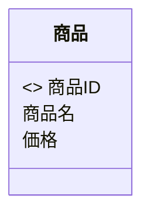
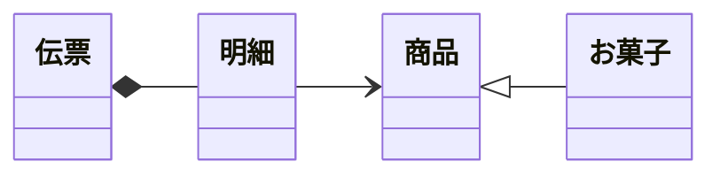
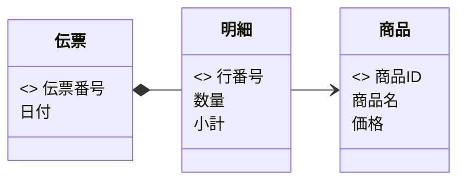
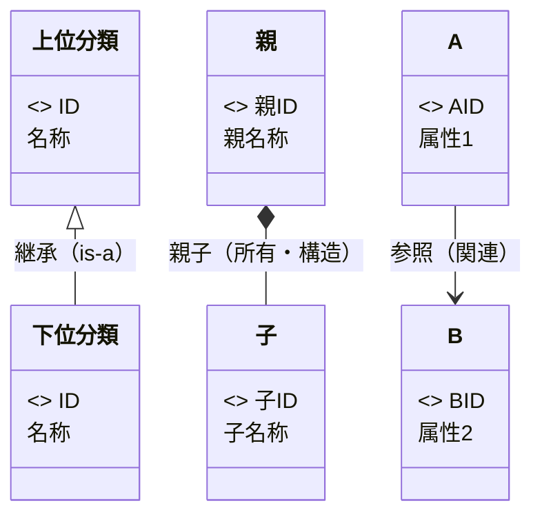

# Mermaid を用いた概念クラス図（CCD）作成ルール

本ドキュメントは、業務分析・要求定義のために **概念モデル（Conceptual Model）を Mermaid の `classDiagram` で記述する標準ルール**です。
実装とは切り離し、概念（エンティティ）とその関係を簡潔に表すことを目的とします。

---

## 1. 全体方針

- Mermaid の **`classDiagram` 構文**を利用する。
- あくまで「概念レベル」のモデルであり、**実装に関わる要素（可視性、型、制御構文など）は書かない**。
- エンティティ（概念）、属性（概念データ）、キー（主キー）、関係の種類を最小限で表す。
- 業務理解・要求定義・用語統一に役立つ表記を優先する。

---

## 2. クラス（エンティティ）のルール

- `class クラス名 { ... }` を用いる。
- **クラス名は日本語**でよい。統一された用語を使用する。
- 属性は改行で列挙する。
- 型・可視性（+ - #）・セミコロンなどは書かない。

### 例



---

## 3. 属性のルール

- 属性は **名前のみ記述する**（型は記述しない）。
- 可視性（+ - #）は **記述しない**。
- 属性の順序は任意だが、キーは先頭に置くことを推奨。

---

## 4. キー（主キー）のルール

- 主キーは **`<<key>>`** を付けて明示する。
- 必要に応じて複合キー複数行を記述してよい。

---

## 5. メソッドの扱い

- **概念クラス図ではメソッドは原則記載しない。**
- 業務上重要な概念的操作のみ例外的に記述可（推奨はしない）。

---

## 6. 関係（リレーション）のルール

概念モデルとして扱う関係は以下の 3 種類に限定する。

### 6.1 概念関係一覧

| 関係の種類 | 別名（Alias）              | 意味・役割                                                   | 特徴（概念モデルとして）                   | 例            |
| ---------- | -------------------------- | ------------------------------------------------------------ | ------------------------------------------ | ------------- |
| 継承関係   | is-a（一般化）             | 上位概念を継承し、下位概念は特殊化された種類であることを表す | 階層構造を作り、共通属性を上位にまとめる   | 商品 → お菓子 |
| 親子関係   | parent-child（所有・構造） | 親が子を束ねる「構造上のまとまり」を示す                     | 子は単独では意味が薄い／親と強固に結びつく | 伝票 → 明細   |
| 参照関係   | reference（関連）          | クラスが別のクラスを参照するゆるやかな関連                   | 双方向・単方向どちらも可／結びつきは弱い   | 明細 → 商品   |

### 6.2 Mermaid における表記法

| 概念関係               | Mermaid 記法  | 説明                     |
| ---------------------- | ------------- | ------------------------ |
| **継承**（is-a）       | `子 <\|-- 親` | 一般化・特化を表現       |
| **親子（所有・構造）** | `親 *-- 子`   | 全体と部分の強い結びつき |
| **参照関係**           | `A --> B`     | ゆるやかな関連           |

#### 例（3 種類の関係を示す）



---

## 7. 命名・表記ルール

- 概念名（クラス名・属性名）は **日本語の単数形**を使う。
- 略語は避け、業務用語と統一する。
- 概念名を英語表記する場合は`CamelCase`を使う。

---

## 8. サンプル



## 9. 凡例



## 10. 生成 AI への指示テンプレート

生成 AI に 概念クラス図を作成させるときは、以下の指示を与える。

> - Mermaid の `classDiagram` 構文を使って、概念クラス図（Conceptual Class Diagram, CCD）を作成してください。
> - 図は **概念レベルのモデル**とし、実装要素（可視性記号、型、メソッド、継承キーワード等）は記述しないでください。
> - クラス（エンティティ）は `class クラス名 { ... }` を用い、**日本語の単数形**で表記してください。英語の場合は `CamelCase` を使用してください。
> - 属性は名前のみ記述し、可視性（+ - #）、型、セミコロンなどは **書かないでください**。
> - 主キーは `<<key>>` を属性の前に記述してください。
> - 関係は以下の3種類を使用し、他の記法は使わないでください。
>   - **継承関係（is-a / 一般化）**： `子 <|-- 親`
>   - **親子関係（所有・構造 / parent-child）**： `親 *-- 子`
>   - **参照関係（関連 / reference）**： `A --> B`
> - 関係は **概念モデルとして意味が明確**になるように選択してください（実装都合で選ばないこと）。
> - クラス名と関係の方向がわかるよう、必要に応じてコメントを記述しても構いません。
> - `凡例`はこのファイル [mermaid-ccd-rules.md](mermaid-ccd-rules.md)を参照するように記載ください。
> - 結果は ` ```mermaid ～``` ` のコードブロックとして出力してください。
> - `凡例` は不要ですが、必要に応じて簡単に説明を加えても構いません。
> - 図全体は読みやすく、概念と関係が一目でわかるようにしてください。
