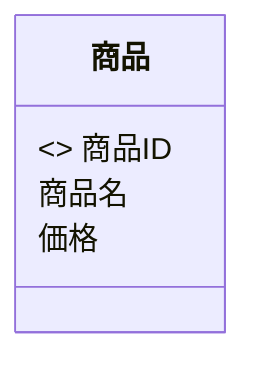
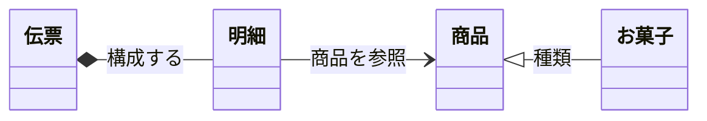
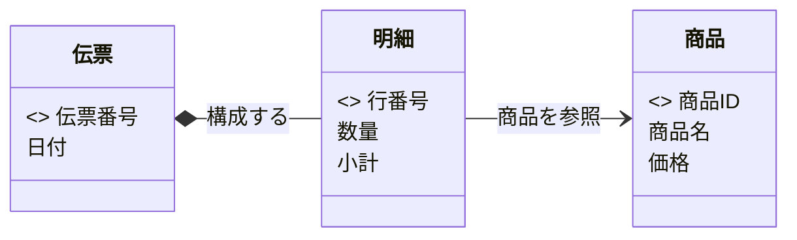
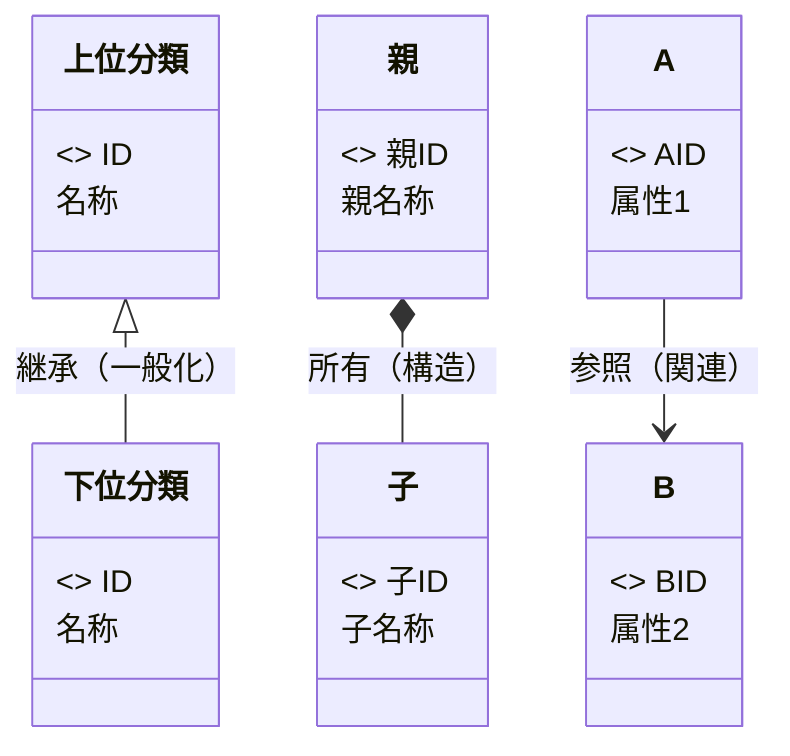

# Mermaid を用いた概念クラス図（CCD）作成ルール

本ドキュメントは、業務分析・要求定義のために **概念モデル（Conceptual Model）を Mermaid の `classDiagram` で記述する標準ルール**です。
実装とは切り離し、概念（エンティティ）とその関係を簡潔に表すことを目的とします。

---

## 1. 全体方針

- Mermaid の **`classDiagram` 構文**を利用する。
- あくまで「概念レベル」のモデルであり、**実装に関わる要素（可視性、型、制御構文など）は書かない**。
- エンティティ（概念）、属性（概念データ）、キー（主キー）、関係の種類と意味を最小限で表す。
- 業務理解・要求定義・用語統一に役立つ表記を優先する。

---

## 2. クラス（エンティティ）のルール

- `class クラス名 { ... }` を用いる。
- **クラス名は日本語の単数形**を基本とする。
- 属性は改行で列挙する。
- 型・可視性（+ - #）・セミコロンなどは書かない。

### 例



---

## 3. 属性のルール

- 属性は **名前のみ記述する**（型は記述しない）。
- 可視性（+ - #）は記述しない。
- 属性の順序は自由だが、キーは先頭に置くことを推奨。

---

## 4. キー（主キー）のルール

- 主キーは **`<<key>>`** を属性名の直前に記述する。
- 複合キーは複数行で記述可能。

---

## 5. メソッドの扱い

- **概念クラス図ではメソッドは原則記載しない。**
- 業務上どうしても必要な概念的操作のみ例外的に記述可（推奨はしない）。

---

## 6. 関係（リレーション）のルール

概念モデルとして扱う関係は以下の 3 種類に限定する。

### 6.1 関係の種類と意味

| 関係の種類 | 別名（Alias）              | 意味・役割                                               | 特徴（概念モデルとして）             | 例            |
| ---------- | -------------------------- | -------------------------------------------------------- | ------------------------------------ | ------------- |
| 継承関係   | is-a（一般化）             | 上位概念を継承し、下位概念は特殊化された種類を表す       | 共通属性を上位にまとめ階層構造を作る | 商品 → お菓子 |
| 親子関係   | parent-child（所有・構造） | 親が子を束ねる「構造上のまとまり」を表す                 | 子は親と一体的／単独では意味が薄い   | 伝票 → 明細   |
| 参照関係   | reference（関連）          | ゆるやかに関連する概念同士のつながりで、参照・依存を示す | 双方向・単方向どちらも可             | 明細 → 商品   |

### 6.2 Mermaid における書き方

| 関係     | Mermaid 記法 | 説明                    |                      |
| -------- | ------------ | ----------------------- | -------------------- |
| 継承関係 | `子 <        | -- 親`                  | is-a（一般化・特化） |
| 親子関係 | `親 *-- 子`  | 所有・構造（part-of）   |                      |
| 参照関係 | `A --> B`    | ゆるい関連（reference） |                      |

### 6.3 **接続線に「意味（役割名）」を必ず記述する**

- 全ての関係線に **`: 関係の意味（役割名）` を付与することを推奨（準必須）**
- 関係の意味は短く明確にする（例：`参照する`、`構成する`、`種類`）

#### 例：



---

## 7. 命名・表記ルール

- **クラス名・属性名は日本語の単数形**で書く。
- 関係名（役割名）は **短く・直感的な日本語**で書く。
- ラベルは以下のように「名詞句」または「短い動詞句」を使う：

| 関係種別 | 例（推奨ラベル）           |
| -------- | -------------------------- |
| 継承     | `種類` `分類`              |
| 親子     | `構成する` `保有する`      |
| 参照     | `参照する` `対象商品` など |

---

## 8. サンプル



---

## 9. 凡例



---

## 10. 生成 AI への指示テンプレート

以下のテンプレートを使うと、生成 AI に正しく CCD を作らせられます。

> - Mermaid の `classDiagram` 構文を使って、概念クラス図（Conceptual Class Diagram, CCD）を作成してください。
> - 図は **概念レベルのモデル**とし、実装要素（可視性記号、型、メソッド、継承キーワード等）は記述しないでください。
> - クラス（エンティティ）は `class クラス名 { ... }` を用い、**日本語の単数形**で表記してください。英語の場合は `CamelCase` を使用してください。
> - 属性は名前のみ記述し、可視性（+ - #）、型、セミコロンなどは **書かないでください**。
> - 主キーは `<<key>>` を属性の前に記述してください。
> - 関係は以下の3種類のみ使用してください：
>   - **継承関係（is-a / 一般化）**： `子 <|-- 親 : 関係名`
>   - **親子関係（所有・構造 / parent-child）**： `親 *-- 子 : 関係名`
>   - **参照関係（関連 / reference）**： `A --> B : 関係名`
> - **すべての関係線に「意味（役割名）」を `: ラベル` の形式で付与してください。意味は短く明確にして下さい（例：`参照する`、`構成する`、`種類`）**
> - 関係は **概念モデルとして意味が明確**になるように選択してください（実装都合で選ばないこと）。
> - `凡例`はこのファイル [mermaid-ccd-rules.md](mermaid-ccd-rules.md) を参照するように記載してください。
> - 結果は ` ```mermaid ～ ``` ` のコードブロックで出力してください。
> - 図全体は読みやすく、概念と関係が一目でわかるようにしてください。


