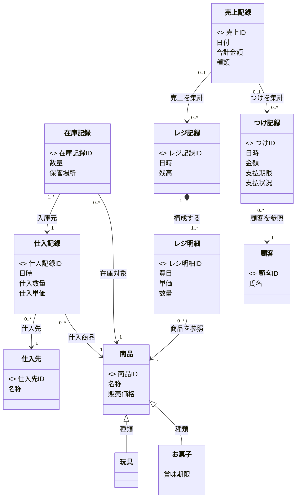

# 全体概念クラス図（現状）

```mermaid
classDiagram

%% =============================
%% 主要クラス定義
%% =============================

class 商品 {
  <<key>> 商品ID
  名称
  販売価格
}

class お菓子 {
  賞味期限
}

class 玩具 {
}

class 在庫記録 {
  <<key>> 在庫記録ID
  数量
  保管場所
}

class 仕入記録 {
  <<key>> 仕入記録ID
  日時
  仕入数量
  仕入単価
}

class 仕入先 {
  <<key>> 仕入先ID
  名称
}

class 売上記録 {
  <<key>> 売上ID
  日付
  合計金額
  %% 現金 / つけ
  種類
}

class 顧客 {
  <<key>> 顧客ID
  氏名
}

class つけ記録 {
  <<key>> つけID
  日時
  金額
  支払期限
  支払状況
}

class レジ記録 {
  <<key>> レジ記録ID
  日時
  残高
}

class レジ明細 {
  <<key>> レジ明細ID
  費目
  単価
  数量
}


%% =============================
%% 継承関係（is-a）
%% =============================

商品 <|-- お菓子 : 種類
商品 <|-- 玩具   : 種類

%% =============================
%% 親子関係（所有・構造 / part-of）
%% =============================

レジ記録 "1" *-- "1..*" レジ明細 : 構成する

%% =============================
%% 参照関係（reference）
%% =============================

売上記録 "0..1" --> "0..*" つけ記録 : つけを集計
売上記録 "0..1" --> "0..*" レジ記録 : 売上を集計

レジ明細 "0..*" --> "1" 商品 : 商品を参照
つけ記録 "0..*" --> "1" 顧客 : 顧客を参照

仕入記録 "0..*" --> "1" 商品 : 仕入商品
仕入記録 "0..*" --> "1" 仕入先 : 仕入先
在庫記録 "0..*" --> "1" 商品 : 在庫対象
在庫記録 "1..*" --> "1" 仕入記録 : 入庫元
```
