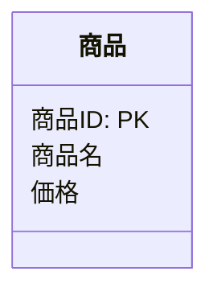
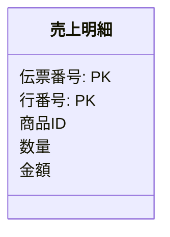
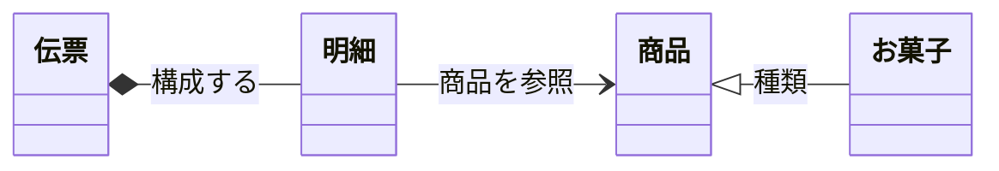
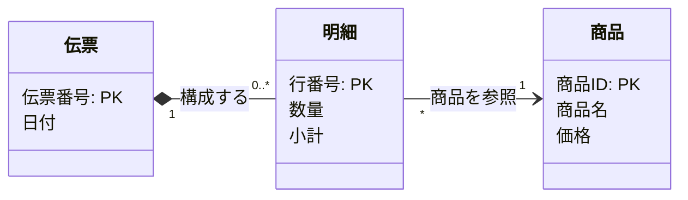
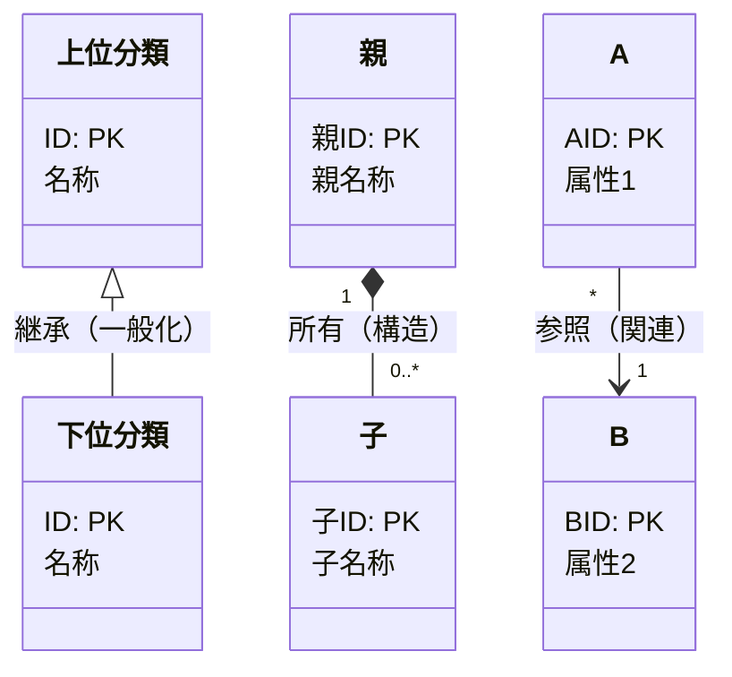

# Mermaid を用いた概念クラス図（CCD）作成ルール

本ドキュメントは、業務分析・要求定義のために **概念クラ図（Conceptual Class Diagram）を Mermaid の `classDiagram` で記述する標準ルール**です。
実装とは切り離し、概念（エンティティ）とその関係を簡潔に表すことを目的とします。

---

## 1. 全体方針

- Mermaid の **`classDiagram` 構文**を利用する。
- あくまで「概念レベル」のモデルであり、**実装に関わる要素（可視性、型、制御構文など）は書かない**。
- エンティティ（概念）、属性（概念データ）、キー（主キー）、関係の種類と意味を最小限で表す。
- 業務理解・要求定義・用語統一に役立つ表記を優先する。

---

## 2. クラス（エンティティ）のルール

- `class クラス名 { ... }` を用いる。
- **クラス名は日本語の単数形**を基本とする。
- 属性は改行で列挙する。
- 型・可視性（+ - #）・セミコロンなどは書かない。

### 例



---

## 3. 属性のルール

- 属性は **名前のみ記述する**（型は記述しない）。
- 可視性（+ - #）は記述しない。
- 属性の順序は自由だが、キーは先頭に置くことを推奨。
- 外部キー項目は属性としてではなく、クラス間の関連（--> や --）で表す。

---

## 4. キー（主キー）のルール

- 主キーは **`: PK`** を属性名の直後に記述する。
- 複合キーは複数行で記述可能。

### 複合キーの記述例



---

## 5. メソッドの扱い

- **概念クラス図ではメソッドは原則記載しない。**
- 業務上どうしても必要な概念的操作のみ例外的に記述可（推奨はしない）。

---

## 6. 関係（リレーション）のルール

概念モデルとして扱う関係は以下の 3 種類に限定する。

### 6.1 関係の種類と意味

| 関係の種類 | 別名（Alias）              | 意味・役割                                               | 特徴（概念モデルとして）             | 例            |
| ---------- | -------------------------- | -------------------------------------------------------- | ------------------------------------ | ------------- |
| 継承関係   | is-a（一般化）             | 上位概念を継承し、下位概念は特殊化された種類を表す       | 共通属性を上位にまとめ階層構造を作る | 商品 → お菓子 |
| 親子関係   | parent-child（所有・構造） | 親が子を束ねる「構造上のまとまり」を表す                 | 子は親と一体的／単独では意味が薄い   | 伝票 → 明細   |
| 参照関係   | reference（関連）          | ゆるやかに関連する概念同士のつながりで、参照・依存を示す | 双方向・単方向どちらも可             | 明細 → 商品   |

### 6.2. 関係ラベル推奨語彙

| カテゴリ | 推奨ラベル例                                           |
| -------- | ------------------------------------------------------ |
| 継承     | 種類 / 分類 / 区分                                     |
| 親子     | 構成する / 保有する / 含む / 明細 / 行 / 履歴          |
| 参照     | 参照する / 対象 / 元伝票 / 請求先 / 商品 / 起点 / 出典 |

禁止: 抽象的過ぎる「関係」「リンク」「関連」。

### 6.3 Mermaid における書き方

| 関係     | Mermaid 記法  | 説明                    |
| -------- | ------------- | ----------------------- |
| 継承関係 | `子 <\|-- 親` | is-a（一般化・特化）    |
| 親子関係 | `親 *-- 子`   | 所有・構造（part-of）   |
| 参照関係 | `A --> B`     | ゆるい関連（reference） |

### 6.4 接続線に「意味（役割名）」を必ず記述する

- 全ての関係線に **`: 関係の意味（役割名）` を付与することを推奨（必須）**
- 関係の意味は短く明確にする（例：`参照する`、`構成する`、`種類`）

### 6.5 多重度（Multiplicity）のルール

多重度は、Mermaid の以下の位置に記述する(原則必須)：

```plaintext
A "多重度A" --> "多重度B" B : 関係名
```

#### 基本表記の例

| 意味          | 多重度                | 説明                       |
| ------------- | --------------------- | -------------------------- |
| 1件のみ       | `"1"`                 | 常に1つ                    |
| 0または1      | `"0..1"`              | 任意、存在しない場合もある |
| 複数（1以上） | `"1..*"`              | 最低1つは存在              |
| 複数（0以上） | `"0..*"` または `"*"` | 数の制約なし               |

#### 記述例（親子）

```plaintext
売上記録 "1" *-- "0..*" 販売明細 : 構成する
```

#### 記述例（参照）

```plaintext
販売明細 "*" --> "1" 商品 : 商品を参照
```

#### 例



---

## 7. 命名・表記ルール

- **クラス名・属性名は日本語の単数形**で書く。
- 関係名（役割名）は **短く・直感的な日本語**で書く。
- ラベルは以下のように「名詞句」または「短い動詞句」を使う：

| 関係種別 | 例（推奨ラベル）                               |
| -------- | ---------------------------------------------- |
| 継承     | `種類` `分類` `区分`                           |
| 親子     | `構成する` `保有する` `含む`                   |
| 参照     | `参照する` `対象商品` `起点` `元伝票` `請求先` |

### 多言語（英語）命名の方針

原則は日本語単数形。英語併用を行う場合は以下のいずれかに揃える。

- ドメイン固有語の国際化が必要：英語 CamelCase に統一（例: `Invoice`, `LineItem`）
- 日本語と英語の混在禁止：同一図内ではどちらか一方に統一。
- 用語集に英語欄がある場合は、その翻訳を優先。図中は日本語、ドキュメント本文で英語対応を示す。

避けるべき混在：`商品` と `Invoice` のようなランダム混在。用途別に図を分割するか名称を統一する。

---

## 8. 関係選択の判断基準

| 判断項目       | 親子（\*--）を使う条件     | 参照（-->）で十分な条件      | 継承（<\|--）を使う条件            |
| -------------- | -------------------------- | ---------------------------- | ---------------------------------- |
| ライフサイクル | 親と同時に生成・削除される | 独立して生成/削除される      | 下位概念が上位の性質を恒常的に持つ |
| 意味の自立性   | 子単独では意味が弱い       | 子単独でも意味が成立する     | 「種類」「分類」による階層自然発生 |
| 複数親の可能性 | ほぼ無い                   | あり得る / 複数参照          | 下位は単一上位を持つ               |
| 再利用性       | 子は親に密結合             | 子は他コンテキストでも再利用 | 共通属性を上位へ抽象化             |
| 変更影響       | 親変更は子へ波及           | 親変更影響は限定的           | 上位変更は全下位へ波及             |

ガイド:

- 迷ったらまず「参照（-->）」でモデル化 → 後続レビューで親子/継承へ昇格させる。
- 継承は濫用しない（2階層程度を推奨）。属性共通率が低いなら参照で表現。

## 9. 継承適用ガイドライン

継承（一般化/特化）を使うべき典型条件：

1. 下位概念群で 60% 以上の属性が共通。
2. 将来的に下位種類が増加する見込みが高い。
3. 上位概念が「分類語（種別、タイプ、カテゴリ）」として自然言語上認知されている。
4. ビジネスルールが上位で一括説明でき、下位差分だけが重要。

避けるべきケース：

- 単一の特殊概念しか存在しない（下位が1種類のみ）
- 共通属性が2～3個程度しかなく、抽象化が冗長になる場合
- 実装都合（ORM最適化等）だけが理由

## 10. 禁止事項

次の記述は概念モデルルールに反するため禁止：

- 型・可視性（public / private / `+` `-` `#`）
- メソッド定義（`calculateTotal()` 等）
- テーブル設計専用のカラム（`created_at` など技術的属性）を概念に含めること
- DTO／API リクエスト構造そのもののクラス化
- 英語と日本語のランダム混在
- 過剰な階層継承（3階層以上）
- 関係線ラベル未記載、または曖昧語（「関連」「関係」）のみ

---

## 11. サンプル



---

## 12. 凡例



---

## 13. 生成 AI への指示テンプレート

生成 AI に概念クラス図を作らせるときは、以下のような指示を与える。

> - Mermaid の `classDiagram` 構文を使って、概念クラス図（Conceptual Class Diagram, CCD）を作成してください。
> - 図は **概念レベルのモデル**とし、実装要素（可視性記号、型、メソッド、継承キーワード等）は記述しないでください。
> - クラス（エンティティ）は `class クラス名 { ... }` を用い、**日本語の単数形**で表記してください。英語の場合は `CamelCase` を使用してください。
> - 属性は名前のみ記述し、可視性（+ - #）、型、セミコロンなどは **書かないでください**。
> - 主キーは `: PK` を属性名の直後に記述してください。
> - 外部キー項目は属性としてではなく、クラス間の関連（--> や --）で表す。
> - 関係は以下の3種類のみ使用してください：
>   - **継承関係（is-a / 一般化）**： `子 <|-- 親 : 関係名`
>   - **親子関係（所有・構造 / parent-child）**： `親 *-- 子 : 関係名`
>   - **参照関係（関連 / reference）**： `A --> B : 関係名`
> - **全ての関係に多重度（"1"、"0..1"、"0..\*" など）を記述してください。**
> - **すべての関係線に「意味（役割名）」を `: ラベル` の形式で付与してください。意味は短く明確にして下さい（例：`参照する`、`構成する`、`種類`）**
> - 関係は **概念モデルとして意味が明確**になるように選択してください（実装都合で選ばないこと）。
> - `凡例`はこのファイル [ccd-mermaid-rules.md](ccd-mermaid-rules.md) を参照するように記載してください。
> - 結果は ` ```mermaid ～ ``` ` のコードブロックで出力してください。
> - 図中のクラス名・属性名には、業務で使う自然な用語を使い、prodNm のようなプログラム変数名は使わないでください。
> - 図全体は読みやすく、概念と関係が一目でわかるようにしてください。

このルールとテンプレートをコピーして、生成 AI のプロンプトに貼り付けて利用してください。なお、[ccd-mermaid-instruction.md](ccd-mermaid-instruction.md)として別ファイルに保存しています。
