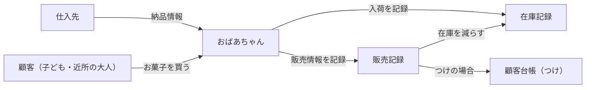

# 概念データフロー図

```mermaid
flowchart LR
  顧客["顧客（子ども・近所の大人）"]
  店主["おばあちゃん"]
  販売記録["販売記録"]
  在庫記録["在庫記録"]
  顧客台帳["顧客台帳（つけ）"]

  顧客 -->|"お菓子を買う"| 店主
  店主 -->|"販売情報を記録"| 販売記録
  販売記録 -->|"在庫を減らす"| 在庫記録
  販売記録 -->|"つけの場合"| 顧客台帳

  仕入["仕入先"]
  仕入 -->|"納品情報"| 店主
  店主 -->|"入荷を記録"| 在庫記録
```
