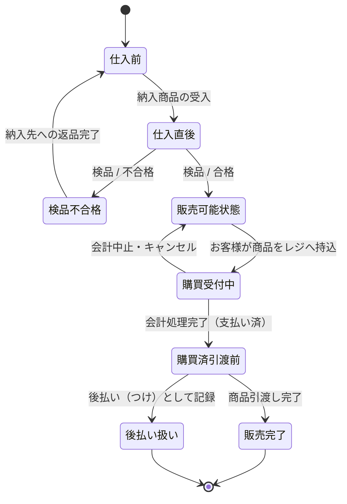

## 概要

現状業務における「商品」の概念的な状態遷移を表します。
状態名・イベント名は「商品ステータス（現状）」をもとに、業務で使われる呼称・行為に合わせて定義しています。

## 概念状態遷移図（CSTD）

## 状態の説明

### 仕入前

仕入れ前の段階で、まだ店舗に到着していない商品。

### 仕入直後

店舗に納入された直後の在庫商品。バックヤードで保管され、検品対象となる。

### 検品不合格

検品の結果、不合格となった返品商品。納入元への返品処理が行われる。

### 販売可能状態

検品に合格し、売り場棚に陳列されている販売可能な商品。

### 購買受付中

お客様が商品をレジに持ち込み、会計処理中の会計対象商品。

### 購買済引渡前

会計が完了し代金は支払われたが、まだお客様への引渡しが完了していない商品。

### 販売完了

お客様への引渡しが完了した販売済商品。

### 後払い扱い

会計の結果、代金を「つけ帳」で管理する掛売商品。つけ回収の対象となる。

## 今後の検討メモ

- 検品不合格後のフロー（廃棄か再仕入れか）を、返品プロセスとあわせて詳細化する余地がある。
- 後払い扱いから「つけ回収完了」への状態遷移は、別途「つけ記録」の概念状態遷移図で表現する想定。
