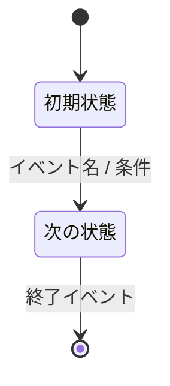
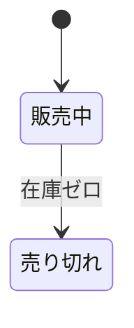
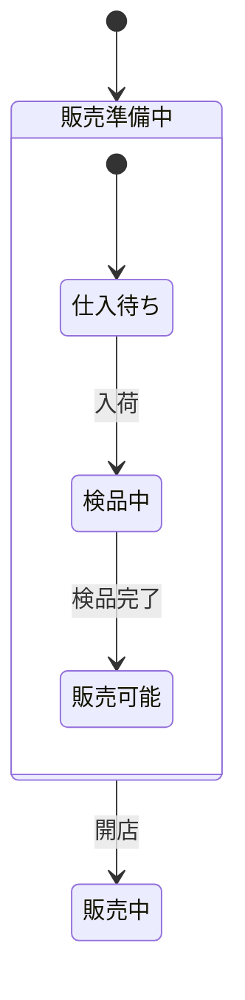
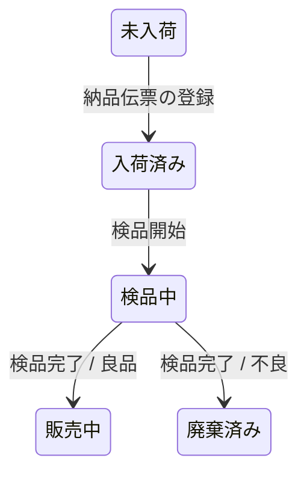
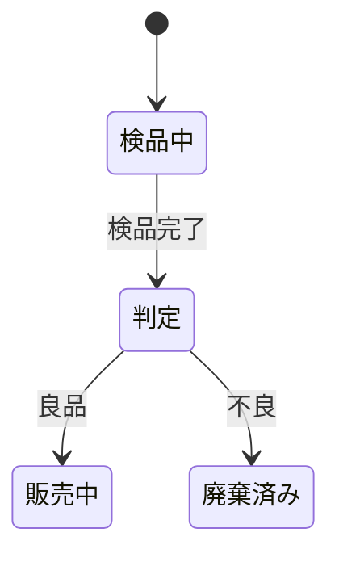
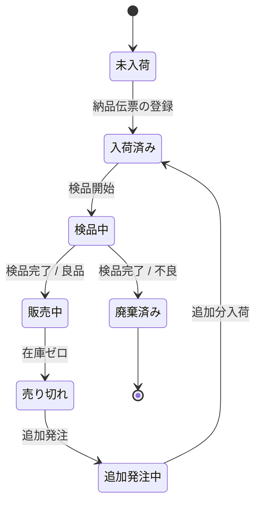
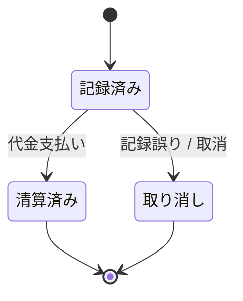

# Mermaid を用いた概念状態遷移図（Conceptual State Transition Diagram）作成ルール

本ドキュメントは、業務仕様・要求定義のために **概念状態遷移図（Conceptual State Transition Diagram: CSTD）を Mermaid の `stateDiagram-v2` で記述する標準ルール**です。
対象とするのは「業務上の対象（商品・つけ記録など）の状態」と「業務イベントによる状態の変化」であり、実装詳細ではなく概念レベルの振る舞いを表現します。

---

## 1. 全体方針

- Mermaid の **`stateDiagram-v2` 構文**を利用する。
- あくまで「概念レベル」の状態遷移図とし、画面遷移図やフローチャートとは区別する。
- 1つの図では、**1つの対象（エンティティ）の状態遷移**にフォーカスする（例：商品の状態、つけ記録の状態）。
- 状態・イベント名は「業務で使う自然な用語」で表現し、内部フラグ名やテーブルカラム名は使わない。

---

## 2. 概念状態遷移図の基本構造

### 2.1 基本構文

- すべての図は以下のように `stateDiagram-v2` から始める。



- 行頭インデントは半角スペース 2 つ以上でそろえる。
- 記法は Mermaid の一般的な状態遷移図記法（内部状態、複合状態、choice など）に準拠する。

### 2.2 初期状態・終了状態

- **初期状態**は `[*]` からの遷移で表す。
  - 例：`[*] --> 未登録`
- **終了状態**がある場合も `[*]` への遷移で表す。
  - 例：`廃棄済み --> [*]`
- 初期状態・終了状態は **各図に 0〜1 個ずつ**あることを基本とする（明示しないことも可だが、原則は明示）。

---

## 3. 状態（state）のルール

### 3.1 状態名のルール

- 状態は **日本語の名詞句**で表現する。
  - 例：`未入荷`、`入荷済み`、`検品中`、`販売中`、`販売停止`、`廃棄済み` など。
- 実装のフラグ名や enum 名（例：`is_active`、`FLAG_01`）は使わない。
- 図内では、同じ意味の状態に対して名前を統一する（「販売中」と「販売可能」を混在させない）。

### 3.2 状態の宣言方法

- 単純状態は、遷移だけ定義してもよい（`state` 宣言は必須ではない）。



- 必要に応じて、`state 状態名 { ... }` で **複合状態**（サブ状態を持つ状態）を定義してよい。



---

## 4. 遷移（transition）のルール

### 4.1 記述形式

- 遷移は `状態A --> 状態B : イベント / 条件` の形式で記述する。
- **イベント名・条件は必須**とする（コロン以降を省略しない）。



### 4.2 イベント名・条件の書き方

- イベント名は **業務イベント**や **操作**を短い日本語で表す。
  - 例：`検品開始`、`検品完了`、`販売`、`返品受付`、`つけ記録登録` など。
- 条件がある場合は、`イベント / 条件` のようにスラッシュで区切る。
  - 例：`検品完了 / 良品`、`検品完了 / 不良`。
- 実装レベルの条件式（`if (stock > 0)` など）は書かず、業務上の意味に言い換える。

### 4.3 自己遷移・分岐

- 同一状態への自己遷移は、必要であれば記述してよい。
  - 例：`販売中 --> 販売中 : 価格変更`。
- Mermaid の `choice` 記法を用いて **分岐条件**を表現してもよい（ただし乱用しない）。



---

## 5. 表記・レイアウトのルール

### 5.1 図の方向

- `stateDiagram-v2` では、デフォルトの縦方向（上→下）を基本とする。
- 状態数が多く横に流したい場合は、レイアウトが極端に崩れない範囲で調整する。

### 5.2 改行・インデント

- 状態・遷移は論理的なグループごとにまとめ、読みやすく改行する。
- 複合状態 `state XXX { ... }` 内は 2 スペース以上でインデントをそろえる。

---

## 6. 命名・表記ルール

- 状態名・イベント名ともに **日本語**を基本とする。
- 実装都合の略語（`stk`, `flg` など）は使わず、業務で使う用語をそのまま使う。
- 図中では「状態のラベル」と「遷移のラベル」を混同しない：
  - 状態：`販売中`、`売り切れ` など **名詞句**。
  - 遷移ラベル：`販売`、`在庫ゼロ` など **イベント／条件**。

### 多言語（英語）命名の方針

- 原則は日本語。
- 英語を使う場合は、図単位で日本語・英語のどちらかに統一する。
- 用語集側に英語対応がある場合は、その対応に合わせる。

---

## 7. 適用範囲と他図との関係

- 本ルールで作成する概念状態遷移図は、主に次の用途に用いる：
  - 商品・在庫・つけ記録など、**業務上の対象のライフサイクル把握**。
  - 例外パターン（キャンセル・返品・廃棄など）の洗い出し。
- 概念データフロー図（DFD）や概念クラス図（CCD）と組み合わせて、
  - 「どのイベントで状態が変わるか」
  - 「どの状態がどのデータストアに対応するか」
    を確認する。

---

## 8. 禁止事項

次の記述は、概念レベルの状態遷移図としては避ける：

- 画面遷移（UI ページ間の移動）をそのまま状態として描くこと。
- 実装条件式そのもの（`if`, `&&`, `||`, `null` など）の記述。
- enum やビットフラグの値そのもの（`0`, `1`, `2` など）だけを状態名にすること。
- 同じ意味の状態に別々の名前をつけること（`利用中`と`使用中`など）。

---

## 9. サンプル

### 9.1 商品の状態遷移（AS-IS の例）



### 9.2 つけ記録の状態遷移（イメージ）



---

## 10. 生成 AI への指示テンプレート

生成 AI に CSTD を作らせるときは、以下のような指示を与える。

> - Mermaid の `stateDiagram-v2` 構文を使って、概念状態遷移図（Conceptual State Transition Diagram, CSTD）を作成してください。
> - 図は **概念レベルの状態遷移**を表し、画面遷移や実装レベルの条件式は記述しないでください。
> - 1つの図では、1つの対象（例：商品、在庫記録、つけ記録など）の状態遷移にフォーカスしてください。
> - 状態名は、日本語の自然な名詞句で表現してください（例：`販売中`、`売り切れ`、`廃棄済み`）。
> - 遷移は `状態A --> 状態B : イベント / 条件` の形式で記述し、**イベント名または条件を必ず書いてください**。
> - 条件がある場合は、`イベント / 条件` のようにスラッシュ区切りで記述し、実装コードではなく業務上の条件に言い換えてください（例：`検品完了 / 良品`）。
> - 初期状態・終了状態がある場合は、`[*] --> 状態`、`状態 --> [*]` で記述してください。
> - 必要に応じて `state 状態名 { ... }` を使い、複合状態（サブ状態）を表現しても構いませんが、図が複雑になりすぎないようにしてください。
> - 状態名・イベント名には、業務で使う自然な用語を使い、フラグ名や略語（`is_active`, `FLAG_01` など）は使わないでください。
> - 結果は ` ```mermaid ～ ``` ` のコードブロックで出力してください。
> - 図全体は読みやすく、状態と遷移の意味が一目で分かるようにしてください。

このルールとテンプレートをコピーして、生成 AI のプロンプトに貼り付けて利用してください。なお、[cstd-mermaid-instruction.md](cstd-mermaid-instruction.md)として別ファイルに保存しています。
