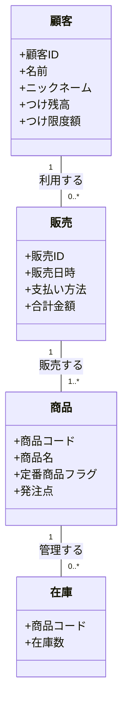

# 概念クラス図

```mermaid
classDiagram
  class 商品 {
    +商品コード
    +商品名
    +定番商品フラグ
    +発注点
  }

  class 在庫 {
    +商品コード
    +在庫数
  }

  class 顧客 {
    +顧客ID
    +名前
    +ニックネーム
    +つけ残高
    +つけ限度額
  }

  class 販売 {
    +販売ID
    +販売日時
    +支払い方法
    +合計金額
  }

  商品 "1" -- "0..*" 在庫 : 管理する
  顧客 "1" -- "0..*" 販売 : 利用する
  販売 "1" -- "1..*" 商品 : 販売する
```
