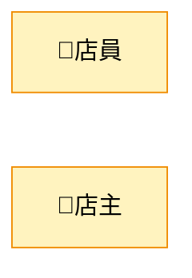
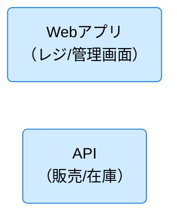
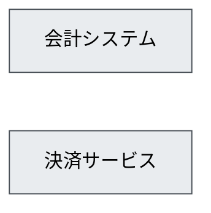
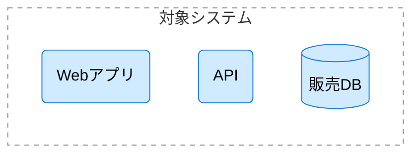
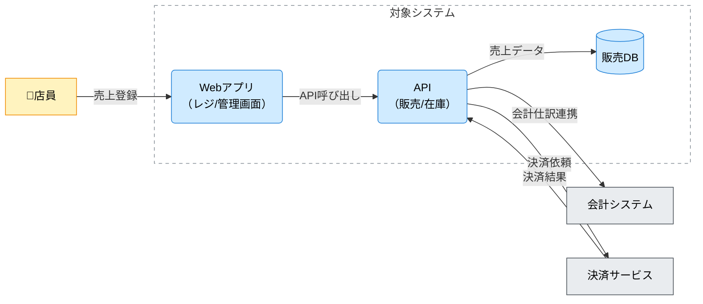
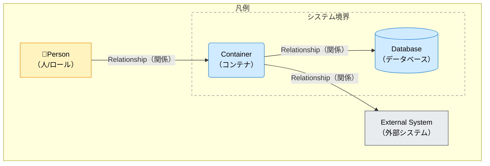

# Mermaid を用いたC4コンテナ図（C4 Container Diagram: CND）作成ルール

本ドキュメントは、アーキテクチャ設計のために、**Mermaid の `flowchart` 構文を使って C4 コンテナ図（Container Diagram）を描く際の標準ルール**です。

C4 コンテナ図は「対象システム」を、**実行/配備単位（コンテナ）**に分割して俯瞰し、利用者（人）・外部システム・データストアとの関係（やり取り）を、概念レベルで合意するために用います。

---

## 1. 全体方針

- Mermaid の **`flowchart` を C4 コンテナ図風に利用**する。
- 対象は「対象システム内の主要コンテナ」と「境界外（人/外部システム）との関係」であり、コンポーネント/クラス等の内部構造は含めない。
- 図は「正確さ（過剰な詳細）」よりも「解釈が割れないこと（合意）」を優先する。
- 1つの図には **対象システムを1つ**だけ置く（複数対象は図を分ける）。

---

## 2. C4要素と Mermaid 記号の対応

C4 の要素を、以下のように Mermaid の記号にマッピングする。

| C4要素                                   | 意味                               | Mermaid での表現例                                                   |
| ---------------------------------------- | ---------------------------------- | -------------------------------------------------------------------- |
| Person（人/ロール）                      | 利用者・関係者                     | `店員["店員"]`                                                       |
| Container（コンテナ）                    | 実行/配備単位（Web/API/バッチ等）  | `Webアプリ("Webアプリ （React）")`                                |
| Database（データベース）                 | 永続データストア                   | `販売DB[("販売DB")]`                                                 |
| External Software System（外部システム） | 連携先システム                     | `会計システム["会計システム"]`                                       |
| System Boundary（境界）                  | 対象システムの範囲                 | `subgraph 境界["対象システム"] ... end`                              |
| Relationship（関係）                     | 利用・連携・参照・データ入出力概念 | `店員 -->\|"売上登録"\| Webアプリ`/`API --> \|"売上データ"\| 販売DB` |

---

## 2.1 標準の色分け（推奨）

C4コンテナ図は色が必須ではありませんが、読み手が「人 / 対象システム内の要素 / 外部システム」を一目で区別できるよう、以下の色分けを推奨します。

- Person（人/ロール）: 暖色系
- 対象システム内（Container / Database）: 寒色系（主役）
- 外部システム（External System）: 無彩色系（脇役）
- 境界（System Boundary）: 破線枠

Mermaid `flowchart` では `classDef` + `class`、境界は `style` を使用します。

### 2.1.1 標準スタイル定義（コピーして利用）

※ 既存の C4 コンテキスト図（CXD）と同じ色指定を利用します。

```mermaid
flowchart LR
  %% --- Standard styles (recommended) ---
  classDef person fill:#fff3bf,stroke:#f08c00,color:#000;
  classDef system fill:#d0ebff,stroke:#1c7ed6,color:#000;
  classDef external fill:#e9ecef,stroke:#495057,color:#000;

  %% System boundary style (subgraph)
  %% NOTE: '境界' は subgraph のID（名前）に合わせる
  style 境界 fill:#ffffff,fill-opacity:0,stroke:#868e96,stroke-width:1px,stroke-dasharray: 5 5;
```

### 2.1.2 適用ルール

- Personノードには `person` クラスを付ける
- 対象システム内の Container / Database には `system` クラスを付ける
- 外部システムノードには `external` クラスを付ける
- 境界は `subgraph 境界[...]` として、`style 境界 ...` で枠線を指定する

---

## 3. ノードのルール

### 3.1 Person（人/ロール）

- **四角 `[]`** を使用する。
- 表示ラベルは業務ロール/主体を短い日本語で表す。

例:

### 3.2 Container（コンテナ）

- **角丸長方形 `()`** を使用する。
- 表示ラベルは「コンテナ名（＋必要なら技術/役割の短い補足）」とする。
- 改行は ` ` を使用してよい（長文化防止）。

例:

### 3.3 Database（データベース）

- **円柱ノード `[(...)]`** を使用する。
- DBの論理名を短く書く（例: `販売DB`, `在庫DB`）。

例:

### 3.4 External Software System（外部システム）

- **四角 `[]`** を使用する。
- 表示ラベルは外部システムの一般名（例: 会計、決済、EC、配送など）。

例:

### 3.5 System Boundary（境界）

- 対象システムは **サブグラフ `subgraph ... end`** で囲う。
- 境界内には、対象システムの **主要コンテナ**（2〜7個程度を目安）と、必要なら主要DBを置く。
- 境界内の要素を増やしすぎない（詳細化はコンポーネント図へ）。

例:

---

## 4. エッジ（関係）のルール

### 4.1 方向

- `A --> B` を基本とする。
- 方向は「主たる依存/利用/送信の向き」が分かるように統一する。
  - 例: 人がシステムを利用する: `人 -->|"利用"| 対象システム内のコンテナ`
  - 例: コンテナ間の呼び出し: `Webアプリ -->|"API呼び出し"| API`
  - 例: DBへの入出力: `API -->|"売上データ"| 販売DB`

### 4.2 ラベル

- すべてのエッジにラベルを付ける（「何の関係か」を合意するため）。
- ラベルは **短い名詞句**または **短い動詞句**で書く。
  - 例: `売上登録` / `在庫照会` / `会計仕訳連携` / `決済結果を受信`
- 長い場合は ` ` で改行してよい。

---

## 5. 命名・表記ルール

- ノードIDは日本語でもよいが、記号や空白は避け、短い識別子にする（例: `Webアプリ`, `API`, `販売DB`, `会計システム`, `店員`）。
- 表示ラベルは `"..."` で囲ってよい（混乱を避けるため、必要に応じて統一）。
- 同じ主体/システム/コンテナ/DBは、図の中で名称を揺らさない。

---

## 6. 禁止事項

| 項目                                                  | 理由                            |
| ----------------------------------------------------- | ------------------------------- |
| 物理テーブル名・物理カラム名・SQL全文                 | コンテナ図の粒度を超える        |
| APIエンドポイント/HTTPメソッド/リクエストJSON等の詳細 | IF仕様に記述する                |
| 実装クラス/関数名、内部モジュールの列挙               | 変更に弱い                      |
| 画面遷移やクリック手順の逐語列挙                      | UI変更に弱い・図の目的から逸脱  |
| コンポーネント/クラス等の内部構造の詳細               | コンポーネント図/実装設計で表す |
| 矢印ラベルなしの関係                                  | 合意が取れない                  |

---

## 7. サンプル（最小）

---

## 8. 凡例（推奨）

凡例は下記のように表現する（必要な場合のみ）。

---

## 9. 生成 AI への指示テンプレート

生成 AI に C4 コンテナ図を作らせるときは、以下のような指示を与える。

以下をそのままプロンプトとして使用できます。

> - Mermaid の `flowchart` 構文で、C4コンテナ図（Container Diagram）を作成してください。
> - 図の中心となる対象システム（System Boundary）は **1つ**だけにしてください（`subgraph 境界["対象システム"] ... end`）。
> - 境界内には、主要なコンテナ（例: Webアプリ / API / バッチ等）と、必要なら主要DBを置いてください（2〜7個程度）。
> - Person（人/ロール）と External Software System（外部システム）があれば必ず含めてください（該当がない場合は理由を明記）。
> - 関係は `-->` で表現し、**すべての矢印にラベル**（短い日本語）を付けてください。
> - 禁止: 物理テーブル名・カラム名・SQL全文、APIエンドポイントやHTTP詳細、実装クラス/関数名、コンポーネント/クラス等の内部構造
> - 色分け（必須）:
>   - Personノードに `person`、境界内（Container/DB）に `system`、外部システムに `external` を付けてください。
>   - 境界（subgraph）は破線枠にしてください。
>   - 以下の定義をそのまま図に含めてください（値は変更しない）：
>     - `classDef person fill:#fff3bf,stroke:#f08c00,color:#000;`
>     - `classDef system fill:#d0ebff,stroke:#1c7ed6,color:#000;`
>     - `classDef external fill:#e9ecef,stroke:#495057,color:#000;`
>     - `style 境界 fill:#ffffff,fill-opacity:0,stroke:#868e96,stroke-width:1px,stroke-dasharray: 5 5;`
> - 出力は Mermaid のコードブロック形式（`mermaidで開始し、` で終了）で提示してください。

このテンプレートをコピーして、生成 AI のプロンプトに貼り付けて利用してください。なお、[cnd-mermaid-instruction.md](cnd-mermaid-instruction.md)として別ファイルに保存しています。
