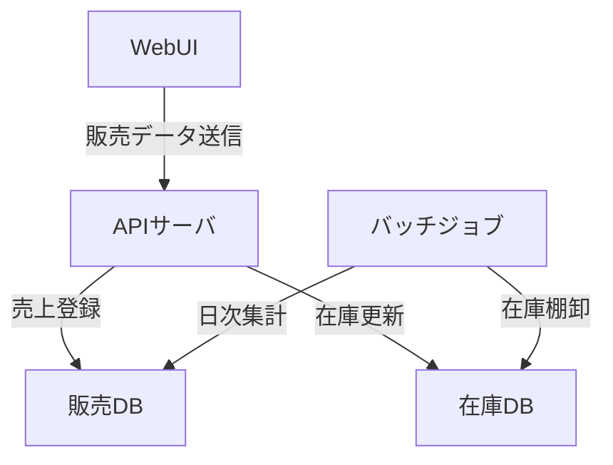

# 010-実装データフロー図

実装レベルでのコンポーネント間・DB間のデータの流れを表現します。

## ドキュメントの目的

- システム実装レベルでのデータ流通・処理順序を明確化し、設計・開発・テスト・運用の品質を高める。
- コンポーネント間・DB間の連携仕様の根拠とする。

## ドキュメントの内容

ドキュメントには、少なくとも以下を含めます。

- 実装データフロー図（Mermaid記法等）
- 各データフローの概要・処理順序
- サンプル（小売業務システム例）

## なぜこのドキュメントが必要か

- データ流通・処理順序を明確にすることで、設計・開発・テスト・運用の品質と効率を高める。
- 連携仕様の認識ズレ・トラブルを防ぐ。

## このドキュメントがないとどう困るか

- データ流通・処理順序が曖昧になり、設計・開発・運用で誤解や手戻りが発生する。
- 連携仕様の認識ズレによる品質低下・トラブルにつながる。

## サンプル

### 実装データフロー図（小売業務システム例/Mermaid記法）

---

注：上記は例です。実プロジェクトの実装データフロー図を具体的に記載してください。
