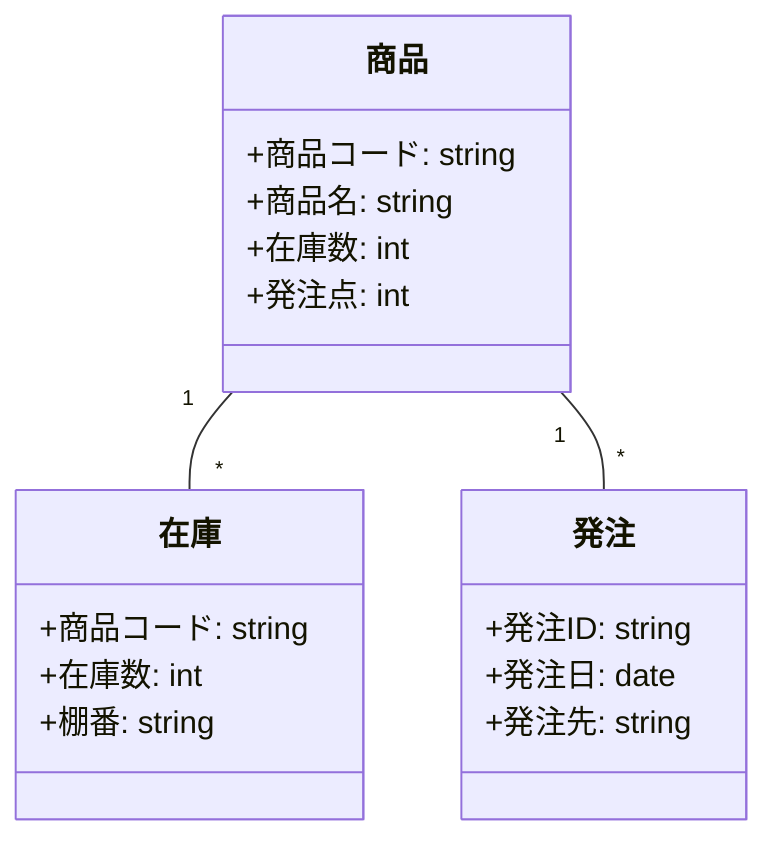

# 020-実装クラス図

実装クラスやサービスの構造をMermaidのclassDiagramで表現します。

## ドキュメントの目的

- 実装レベルでのクラス・サービス・エンティティの構造・関係性を明確化し、設計・開発・テスト・運用の品質を高める。
- 実装設計・レビュー・保守の根拠とする。

## ドキュメントの内容

ドキュメントには、少なくとも以下を含めます。

- 実装クラス図（Mermaid classDiagram等）
- 各クラス・サービスの概要・関係性
- サンプル（小売業務システム例）

## なぜこのドキュメントが必要か

- クラス・サービス・エンティティの構造・関係性を明確にすることで、設計・開発・テスト・運用の品質と効率を高める。
- 実装設計・レビュー・保守の認識ズレ・トラブルを防ぐ。

## このドキュメントがないとどう困るか

- クラス・サービス・エンティティの構造・関係性が曖昧になり、設計・開発・運用で誤解や手戻りが発生する。
- 実装設計・レビュー・保守の認識ズレによる品質低下・トラブルにつながる。

## サンプル

### 実装クラス図（小売業務システム例/Mermaid classDiagram）

---

注：上記は例です。実プロジェクトの実装クラス図を具体的に記載してください。
