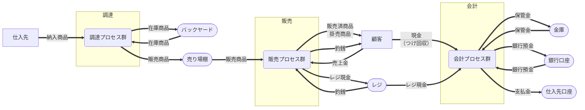
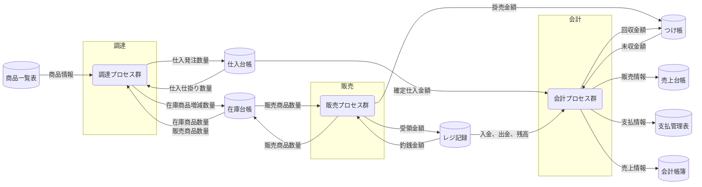

# 全体概念データフロー図（現状）

## プロセスグループ概要

| プロセスグループ | 主な業務                                 | 業務目的                                           |
| ---------------- | ---------------------------------------- | -------------------------------------------------- |
| 調達             | 発注・受入・在庫管理                     | 売るための商品を確保する。商いの原資をつくる。     |
| 販売             | 商品の提示・販売受付・代金受領・商品引渡 | 商品をお客様に提供し、対価のやり取りを成立させる。 |
| 会計             | レジ締め・売上記録・仕入支払い・帳簿管理 | お金の流れを正確に把握し、商いの継続を可能にする。 |

## 外部主体と物理保管に着目した概要フロー

凡例は[こちら(cdfd-mermaid-rules#6.凡例)](../../../handbook/ja/rules/cdfd-mermaid-rules.md#6-凡例)を参照してください。

## データストアに着目した概要フロー

