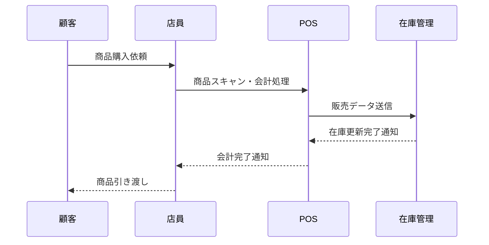

# 040-シーケンス図

ユースケースごとの処理の時系列をシーケンス図で表現します。

## ドキュメントの目的

- 業務・システムのユースケースごとの処理手順・時系列を明確化し、設計・開発・テスト・運用の品質を高める。
- 処理順序・連携仕様の根拠とする。

## ドキュメントの内容

ドキュメントには、少なくとも以下を含めます。

- シーケンス図（Mermaid記法等）
- 各処理手順・時系列の概要
- サンプル（小売業務システム例）

## なぜこのドキュメントが必要か

- 処理手順・時系列を明確にすることで、設計・開発・テスト・運用の品質と効率を高める。
- 連携仕様の認識ズレ・トラブルを防ぐ。

## このドキュメントがないとどう困るか

- 処理手順・時系列が曖昧になり、設計・開発・運用で誤解や手戻りが発生する。
- 連携仕様の認識ズレによる品質低下・トラブルにつながる。

## サンプル

### シーケンス図（小売業務システム例/Mermaid記法）

---

注：上記は例です。実プロジェクトのシーケンス図を具体的に記載してください。
